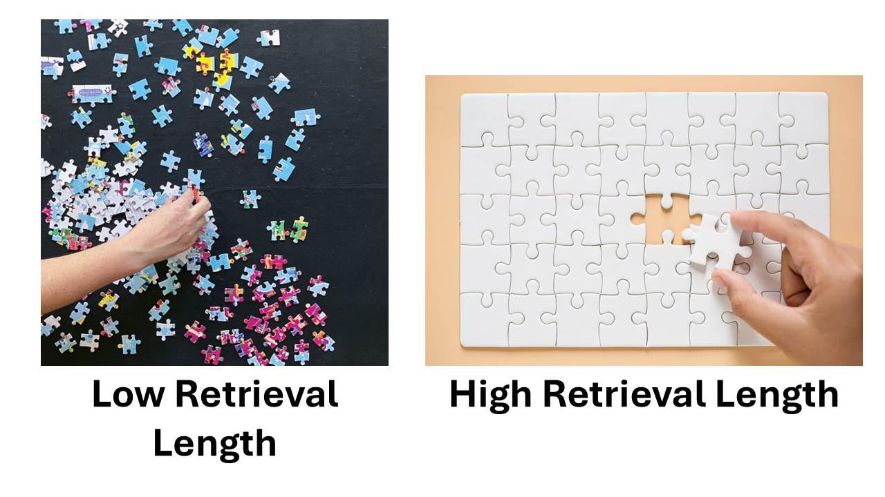
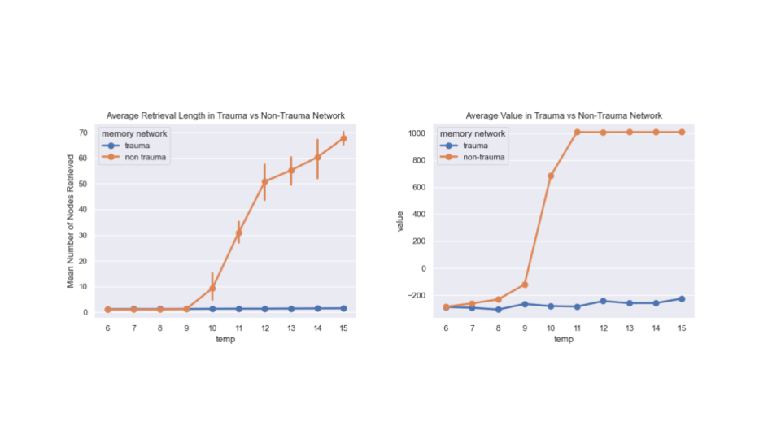

```{python}
#| echo: false
import random
import rustworkx as rx
import numpy as np
import math
```

# Autobiographical Memory

## Generating Memory Network

The first step is to create our memories. 


According to Conway and Pearce (2000), autobiographical memory can be divided into three main components: 

- lifetime periods ("When I was younger")
- general events ("I went on a trip during summer break")
- event specific knowledge (ESK) ("I smelled the smoke of the wildfire")

For this model, we will be focusing on the lowest layer (ESK), as that is what people with OGM often have trouble remembering. The goal is to create an undirected graph with the following properties:

- Every node is an individual ESK, and is connected to every other node
- Each node has a base-level activation that decays over time and spikes whenever it is retrieved.
- The edges contain weights which represent how closely associated two memories are. This is the spreading activation.

## Spreading Activation

In the spreading activation model of memory retrieval, activation of one node causes activation of a connected node which repeats until retrieval is terminated through some process. It makes sense then that nodes which are more closely connected (ESK's of the same general event) would be more likely to activate each other than ESK's that are unrelated.


Every pair of nodes has a *strength of association* that describes how closely related two memories are, and determines the value for the spreading activation.

To calculate the probability of a memory being retrieved, we would first have to consider the total activation of every node, defined as the base-level activation + spreading activation + noise. Then, the model would probabilistically choose a node that is above a pre-defined threshold using the activations as the weights.

$A=B+S+\epsilon$

## ACT-R Model of Memory Decay

Although the spreading activation is assumed to remain constant in this model, base-level activation does change. This is because memory decays over time to the point at which it is forgotten, while retrieving the memory helps retain it. Every time a memory is recalled, this means that a new "trace" is created.


The equation above shows how base-level activation is calculated, and it is what my model uses. Each trace is maximally active during creation when $t = 1$, and exponentially decays as $t$ gets larger due to the negative d. Then, all of the traces are summed to give the final base-level activation. 

## Code

Building a large memory network requires a lot of data, since not only do you need activation values for each of the nodes but also edges between *each node and every other node*. For a memory network with 100 memories, that would already be $\frac{100*99}{2}=4950$ edges, and would scale exponentially with every additional node added.

Because of this, I decided to use the rustworkx library, which is based on a common network analysis library called networkx but with better performance. This library has the capability to create and interact with graphs, and assign weights to nodes and edges.

## Memory Class

```{python}
#| code-line-numbers: "|2-24|26-44|46-48"
class Memory:
    def __init__(self, n, groups, rewards, state=None, thres=0, sigma=0.1):
        group_size = n // groups # <2>

        def weight(i, j): # <2>
            return 10 if (i // group_size == j // group_size) else 0 # <2>

        graph = rx.PyGraph()
        graph.add_nodes_from([[1]] * n) # <1>
        graph.add_edges_from([ # <2>
            (i, j, weight(i, j)) # <2>
            for i in range(n) # <2>
            for j in range(i + 1, n) # <2>
        ])
        self.graph = graph
        self.state = state
        self.thres = thres
        self.current_graph = graph.copy()
        self.sigma = sigma
        self.state = state
        self.rewards = rewards

    def initialize_state(self):
        self.state = random.choice(range(len(list(self.graph.nodes()))))

    def spreading_activation(self):
        graph = self.current_graph
        adj = graph.adj(self.state)
        neighbors = list(adj.keys())
        activations = []
        for j in neighbors:
            sum_t = sum(trace ** -0.5 for trace in graph[j]) # <3>

            activation = adj[j] + math.log(sum_t) + random.gauss(0, self.sigma) # <4>
            if activation > self.thres:
                activations.append(activation)
            else:
                activations.append(0)
        if sum(activations) == 0:
            return False
        next_state = random.choices(neighbors, weights=activations, k=1)[0] # <5>
        self.graph[next_state] = self.graph[next_state] + [1] # <6>
        graph.remove_node(self.state)
        return next_state

    def decay(self, time):
        for node in self.graph.node_indices():
            self.graph[node] = [trace + time for trace in self.graph[node]] # <7>
```

1. During creation, all nodes have a single trace with a time value of 1.
2. The memories are separated into a number of groups, determined by the `groups` parameter. Spreading activation for memories within a group is initialized as 10, and 0 otherwise.
3. Base-level activation that is calculated using the ACT-R equation.
4. The previously calculated base-level activation is added to spreading activation and a noise parameter.
5. The next memory to recall is probabilistically chosen using their activations.
6. After the next node is chosen, another trace is added to indicate a successful retrieval.
7. Because the ACT-R equation already handles the effect of time on activation, "decaying" a memory only requires us to add a time increment to each trace in a node.

# Reinforcement Learning

## Agent

In reinforcement learning, an agent learns to explore its environment in order to maximize rewards. This is what that means in terms of my model:

- Environment: The memory network defined in the previous section.
- Agent: Decision-making process in the brain that decides whether to continue or terminate retrieval.
- Reward: How useful (or traumatic) a memory is.

The reward is actually a property of the memory network itself. To simplify the model, for now I will assume that there is one "trauma" memory which has a very negative reward, and all of the other memories have small positive rewards.

The way that the agent makes the decision to continue or terminate depends on what the agent expects the reward to be at its current node, also known as the *value*. It keeps track of these values in a *v-table* which gets built up over time as the agent explores more and more of its network.

## Reward Prediction Error

$\delta_t=r_{t+1}+\gamma V(s_{t+1})-V(s_t)$

The above equation is a simplified version of how the agent updates its v-table in response to new information. The immediate reward $r_{t+1}$ is added to the future value $V(s_{t+1})$ and subtracted from the current value $V(s_t)$ to create a value of how much more or less reward it got than expected.

This $\delta_t$ is then added to the current value in the vtable after being scaled by an $\alpha$ parameter.

## Parameters

The agent has a few parameters which are featured in this model

- $\alpha$ (alpha): learning rate. Higher $\alpha$ will result in the agent changing its values more quickly in response to new information
- $\gamma$ (gamma): discount factor. Defines how heavily it weighs future rewards.
- temperature: A source of "randomness", a willingness to make "unoptimal" decisions. An agent with a lower temperature is more likely to *exploit* and stick with the options it knows are best, while an agent with higher temperature is more willing to *explore* and take more chances in the short-term in order to explore its environment.

These parameters can all be altered, resulting in slightly different behavior for the agent as it learns.

## Agent Class

```{python}
#| code-line-numbers: "|2-5|16|17-21,24-30|22-23|19-20|28-29"
class Agent:
    def __init__(self, alpha=0.1, gamma=0.9, temp=0.1): # <1>
        self.alpha = alpha # <1>
        self.gamma = gamma # <1>
        self.temp = temp # <1>
        self.vtable = {}
    
    def policy(self, network):
        s1 = network.state
        if s1 not in self.vtable:
            self.vtable[s1] = 1
        v1 = self.vtable[s1]
        if v1 / self.temp < -50:
            recall = False
        else:
            recall = 1 / (1 + np.e ** (-v1 / self.temp)) > random.random()
        if recall:
            s2 = network.spreading_activation()
            if s2 is False:
                return False
            network.state = s2
        else:
            return False
        if s2 not in self.vtable:
            self.vtable[s2] = 1
        v2 = self.vtable[s2]
        r = network.rewards[s2]
        rpe = r + self.gamma * v2 - v1
        self.vtable[s1] += self.alpha * rpe
        return True
```

1. Agent Parameters

# Results

## Simulator

To run the agent in the envrionment multiple times, I have created a simulator class that defines methods for single and multiple retrievals.

```{python}
class Simulator:
    def __init__(self, agent, network):
        self.states_visited = []
        self.record = []
        self.agent = agent
        self.network = network
    
    def retrieve(self, max_steps, decay, time):
        recall = True
        steps = 0
        self.network.initialize_state()
        self.network.current_graph = self.network.graph.copy()
        while recall and steps < max_steps:
            self.states_visited.append(self.network.state)
            recall = self.agent.policy(self.network)
            steps += 1
        if decay:
            self.network.decay(time)

    def run(self, n, max_steps, decay=True, time=10):
        for _ in range(n):
            self.retrieve(max_steps, decay, time)
            self.record.append(self.states_visited)
            self.states_visited = []
```

## Dependent Variables

Unlike in real life, it is impossible to ask this model to describe a memory to us. Instead, to measure how overgeneral a memory is I've decided to look at the number of nodes encountered during retrieval, or what I will call the *retrieval length*. Smaller retrieval lengths indicate that less details are recalled and thus the memory is more vague, similar to how actual people with OGM would behave. Since I am running the agent through multiple trials in all of my simulations, I could either describe the average retrieval length over all trials or just the final one. In my graphs below, I use both of these values.



## Testing

For this trial, I kept most of the default settings with a memory network that had one negative reward of -10 and the rest positive rewards of 1. Then, I ran the agent for 20 trials and displayed the number of memories retrieved for each trial.

```{python}
default_rewards = {i: 1 for i in range(100)}
default_rewards[0] = -10
environment = Memory(100, 20, default_rewards)
agent = Agent()
test = Simulator(agent, environment)
test.run(20, 99, decay=False)
for trial in test.record:
    print(len(trial))
```

## Visualization


```{python}
#| echo: false
import seaborn as sns
import matplotlib.pyplot as plt
import pandas as pd
```

To help make the results easier to see, I ran ten simulations of 10 trials each and plotted the retrieval length for each trial on a line graph.

```{python}
#| code-fold: true
ys = []
for _ in range(10):
    environment = Memory(100, 20, default_rewards)
    agent = Agent()
    test = Simulator(agent, environment)
    test.run(10, 99, time=0.1)
    retrieval_length = [len(trial) for trial in test.record]
    sns.lineplot(x=range(1, 11), y=retrieval_length)
plt.xlabel("time")
plt.ylabel("retrieval_length")
plt.ylim(0, 100)
plt.show()
```

## Experiment 1: Agent Parameters

As mentioned before, there are three parameters that I can control for the agent: $alpha$, $gamma$, and temperature. While keeping everything else constant, I varied these three parameters one by one and plotted the average and final retrieval lengths.

```{python}
#| code-fold: true
def exp_1(opt, params, n):
    avg_retrieval = []
    final_retrieval = []
    for p in params:
        if opt == "alpha":
            agent = Agent(alpha=p)
        elif opt == "gamma":
            agent = Agent(gamma=p)
        elif opt == "temp":
            agent = Agent(temp=p)
        environment = Memory(100, 20, default_rewards)
        test = Simulator(agent, environment)
        test.run(n, 99, time=0.1)
        retrieval_length = [len(trial) for trial in test.record]
        avg_retrieval.append(np.mean(retrieval_length))
        final_retrieval.append(retrieval_length[-1])
    return avg_retrieval, final_retrieval
    
fig, axs = plt.subplots(3, 2, sharey=True)
alphas = [n / 100 for n in range (1, 21)]
gammas = [n / 100 for n in range(80, 100)]
temps = [n / 100 for n in range(1, 21)]
ax_count = 0
for opt, params in {"alpha": alphas, "gamma": gammas, "temp": temps}.items():
    avg_retrieval, final_retrieval = exp_1(opt, params, 20)
    sns.lineplot(x=params, y=avg_retrieval, ax=axs[ax_count][0])
    sns.lineplot(x=params, y=final_retrieval, ax=axs[ax_count][1])
    axs[ax_count][0].set_xlabel(opt)
    axs[ax_count][1].set_xlabel(opt)
    ax_count += 1
fig.suptitle("Average and Final Retrieval Lengths")
plt.tight_layout()
plt.show()
```

While varying the gamma and temperature did not seem to affect the retrieval lengths much, increasing alpha tended to decrease retrieval length. This is probably due to the "trauma" memory having an outsized effect the moment it is encountered.

## Experiment 2: Environment Parameters

Next, I kept the agent parameters at their default values while varying attributes of the memory network itself.

```{python}
#| code-fold: true
def exp_2(n, groups, max_length, runs=100, time=0.1, rewards=None):
    agent = Agent()
    if rewards is None:
        rewards = {i: 1 for i in range(n)}
        rewards[0] = -10
    environment = Memory(n, groups, rewards)
    test = Simulator(agent, environment)
    test.run(runs, max_length, time=time)
    retrieval_length = [len(trial) for trial in test.record]
    return retrieval_length
```

## Varying Time Between Retrievals

```{python}
#| code-fold: true
data = []
n = 100
groups = 10
for t in [0.1, 1, 10, 100]:
    lengths = exp_2(n, groups, max_length=n - 1, time=t)
    avg = np.mean(lengths)
    final = lengths[-1]
    data.append({"time": t, "type": "average", "value": avg / n})
    data.append({"time": t, "type": "final", "value": final / n})
sns.catplot(data=pd.DataFrame(data), x="time", y="value", hue="type", kind="bar")
plt.title(f"Percent of total memories retrieved for {n} memories and {groups} groups")
plt.show()
```

## Varying Rewards Table

- r1: 1 small (-10) negative reward
- r2: 1 large (-100) negative reward
- r3: 5 small (-10) negative rewards in the same group
- r4: 5 large (-100) negative rewards in the same group

```{python}
#| code-fold: true
data = []
groups = 10
n = 100
rewards = {i: 1 for i in range(n)}
rewards1 = rewards.copy()
rewards2 = rewards.copy()
rewards3 = rewards.copy()
rewards4 = rewards.copy()
rewards1[0] = -10
rewards2[0] = -100
for i in range(5):
    rewards3[i] = -10
    rewards4[i] = -100
for r, name in zip([rewards1, rewards2, rewards3, rewards4], ["r1", "r2", "r3", "r4"]):
    lengths = exp_2(n, groups, max_length=n - 1, time=0.1, rewards=r)
    avg = np.mean(lengths)
    final = lengths[-1]
    data.append({"reward": name, "type": "average", "value": avg / n})
    data.append({"reward": name, "type": "final", "value": final / n})
sns.catplot(data=pd.DataFrame(data), x="reward", y="value", hue="type", kind="bar")
plt.title(f"Percent of total memories retrieved for {n} memories and {groups} groups")
plt.show()
```

## Varying Number of Nodes While Keeping Groups Constant

```{python}
#| code-fold: true
data = []
groups = 10
for i, n in enumerate([50, 100, 150, 200, 250]):
    rewards = {i: 1 for i in range(n)}
    for _ in range(i):
        rewards[_] = -10
    lengths = exp_2(n, groups, max_length=n - 1, rewards=rewards)
    for length in lengths:
        data.append({"n": n, "value": length / n})
sns.catplot(data=pd.DataFrame(data), x="n", y="value", kind="bar")
plt.title(f"Percent of total memories retrieved for varying numbers of memories (number of groups constant)")
plt.show()
```

## Varying Number of Nodes and Groups

```{python}
#| code-fold: true
data = []
for i, n in enumerate([50, 100, 150, 200, 250]):
    rewards = {i: 1 for i in range(n)}
    groups = n // 10
    for _ in range(i):
        rewards[_] = -10
    lengths = exp_2(n, groups, max_length=n - 1, rewards=rewards)
    for length in lengths:
        data.append({"n": n, "value": length / n})
sns.catplot(data=pd.DataFrame(data), x="n", y="value", kind="bar")
plt.title(f"Percent of total memories retrieved for varying number of memories (group size constant)")
plt.show()
```

# Next Steps

## Comparison with Old Model



The previous iteration of this model did not have spreading activation or memory decay, only reinforcement learning. However, I did move the agent from a "trauma network" with one large negative memory, to a "non-trauma network" with no negative memories, and recorded how it behaved with varying the temperature parameter.

- Not sure if this manipulation is an accurate representation of context switching in an actual person's brain, however.

## More parameter exploration

Until now I've chosen some values (arbitrarily) as the default and varied parameters one at a time. However, it might also be interesting to vary parameters together with multiple independent variables. In addition, I need to confirm which parameters are most plausible.

## Increasing Network Size

The most interesting results so far were with increasing the number of nodes. Given that an actual human's brain contains much more than 100 pieces of autobiographical memory, I have to investigate further what is both a plausible and feasible number of nodes to model, and what the connectivity structure should look like. I would also like to increase the time scale to simulate memories truly being forgotten.
